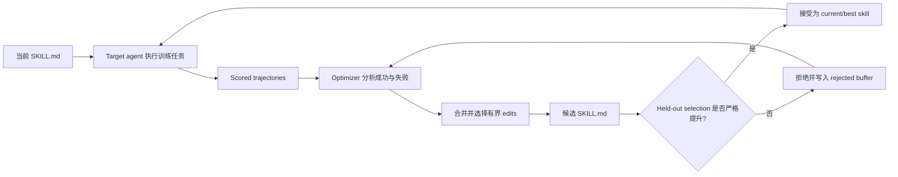

# SkillOpt 论文精读指南

> 论文：[SkillOpt: Executive Strategy for Self-Evolving Agent Skills](https://arxiv.org/abs/2605.23904)
> 项目：[Microsoft SkillOpt](https://microsoft.github.io/SkillOpt/)
> 本指南目标：先建立正确直觉，再理解公式、算法、实验和安全含义。

## 先记住一句话

SkillOpt 的核心不是“让模型自己训练自己”，而是：

> **冻结 agent 的模型参数，用另一个 optimizer model 根据任务成败，反复修改一份自然语言操作手册；只有新手册在独立验证集上表现更好，才允许保存。**

可以把四个组件想成：

| 论文概念 | 直觉类比 |
|---|---|
| Target model | 负责比赛的运动员，能力本身不训练 |
| Optimizer model | 看录像、总结问题的教练 |
| Skill document | 可修改的战术手册 |
| Validation gate | 新战术正式采用前的独立测试 |

论文真正训练的是“手册”，不是“运动员的大脑”。

## 方法直觉

### 一个贯穿例子

假设一个 spreadsheet agent 经常出现两个问题：

1. 修改公式后没有重新计算；
2. 最终只检查几个可见单元格，没有验证整个目标区域。

SkillOpt 会这样工作：

1. **Rollout**：让当前 agent 带着现有 skill 完成一批 spreadsheet tasks，保存消息、工具调用、执行轨迹、最终文件和 verifier 分数。
2. **Split success/failure**：把成功案例和失败案例分开。失败告诉 optimizer 缺什么；成功告诉它哪些现有规则不能破坏。
3. **Minibatch reflection**：optimizer 不只看一个失败，而是看一组失败，寻找可复用模式。例如“多次失败都发生在公式修改后未重新计算”。
4. **Propose edits**：optimizer 提出 ADD、DELETE、REPLACE，例如加入“修改公式后强制重算，并验证整个目标区域”。
5. **Merge and rank**：不同 minibatch 可能提出重复或冲突建议，先合并，再按预期价值排序。
6. **Textual learning rate**：一次最多采用 (L_t) 条 edit。它类似学习率，限制一次更新幅度，避免整份 skill 被大改坏。
7. **Build candidate**：把选中的多条 edit 应用到当前 skill，形成一个候选手册。
8. **Validation gate**：用候选 skill 在独立 selection tasks 上重新执行。只有分数严格上升才接受；相同分数也拒绝。
9. **Rejected buffer**：若候选失败，把失败模式和被拒 edits 留给同一 epoch 后续 optimizer，提醒它不要重复同一路线。
10. **Export**：训练结束只导出最佳 `best_skill.md`。部署时不再需要 optimizer。

整条链是：

### 为什么不直接重写全文

完整 rewrite 很容易删掉已验证有效的规则，或者因为单个失败案例写入过度具体的补丁。SkillOpt 用结构化 ADD/DELETE/REPLACE 和 edit budget，把一次更新限制成小步变化。

这就是论文所谓的 **textual learning rate**。它不是梯度下降中的数值步长，而是“一次最多允许改多少条文本规则”。

## 公式理解

### 执行函数

论文写成：

\[
(\tau(s),r(s))=h(M,x,s), \qquad r(s)\in[0,1].
\]

逐项解释：

- (M)：被冻结的 target model；
- (x)：一个具体任务；
- (s)：当前 skill 文档；
- (h)：执行环境或 harness，例如 direct chat、Codex、Claude Code；
- (\tau(s))：执行轨迹；
- (r(s))：verifier 给出的任务得分。

这条公式只是在说：同一个模型做同一个任务时，换一份 skill 可能产生不同轨迹和得分。

### 三个数据集

SkillOpt 把数据分成：

| Split | 用途 | 是否参与最终报告 |
|---|---|---|
| (D_{train}) | 产生 rollout evidence，供 optimizer 提议 edits | 否 |
| (D_{sel}) | 接受或拒绝 candidate skill | 否 |
| (D_{test}) | 训练结束后评估最终 best skill | 是 |

候选选择公式：

\[
s^*_{sel}=\arg\max_{s\in\mathcal C(D_{train})}
\frac{1}{|D_{sel}|}\sum_{x\in D_{sel}}r(x;s).
\]

不要被公式吓到。它只表示：所有由训练证据生成的候选中，选择 selection 平均分最高的那一份。

最后再计算：

\[
\mathrm{Test}(s^*_{sel})=
\frac{1}{|D_{test}|}\sum_{x\in D_{test}}r(x;s^*_{sel}).
\]

Selection 类似开发集，test 是锁定的最终考试。论文想证明的是：optimizer 没有直接看 test，却学出能泛化到 test 的 procedure。

## 论文创新

### 外部状态优化

以前的方法通常是人工写 skill、一次性让 LLM 生成 skill，或者比较松散地从轨迹总结经验。SkillOpt 的观点是：自然语言 skill 可以像参数一样成为一个明确的 optimization state。

这使整个过程有 current state、candidate、learning-rate budget、validation、rejected feedback 和 best checkpoint，而不是无条件自我重写。

### 执行与优化分离

Target model 只负责做任务，optimizer model 负责读轨迹和修改 skill。强 optimizer 可以离线训练较弱 target 的手册，但部署时只携带最终 skill，不携带 optimizer。

因此论文的成本结构是：训练贵，部署便宜。它更适合会重复执行很多次的任务，而不适合只做一次的临时任务。

### 失败与成功同时学习

只看失败容易“矫枉过正”。成功 trajectories 用来告诉 optimizer 哪些行为已经有效，应当保留；失败 trajectories 用来提出修复。分开 reflection 后再 merge，是论文稳定性的一个重要来源。

### 拒绝也成为反馈

候选被 gate 拒绝后不会简单消失。Rejected buffer 告诉 optimizer：“这组修改已经试过，并导致多少分数下降”。这相当于自然语言形式的负反馈。

### 慢更新与 meta skill

Step-level edits 处理当前 batch 的局部问题；epoch-wise slow update 比较相邻 epoch，抽取持续改进、回退、长期失败和稳定成功。Meta skill 只服务 optimizer，记录哪些 edit 模式有效，不随最终 skill 部署。

直觉上：普通 edit 是修改运动员的战术手册；meta skill 是教练自己的执教笔记。

## 实验解读

### 主结果

论文覆盖 SearchQA、SpreadsheetBench、OfficeQA、DocVQA、LiveMath 和 ALFWorld，并使用七个 target models、direct chat/Codex/Claude Code 三类 harness。

GPT-5.5 direct-chat 的代表结果是：

| Benchmark | No skill | SkillOpt | 提升 |
|---|---:|---:|---:|
| SearchQA | 77.7 | 87.3 | +9.6 |
| Spreadsheet | 41.8 | 80.7 | +38.9 |
| OfficeQA | 33.1 | 72.1 | +39.0 |
| DocVQA | 78.8 | 91.2 | +12.4 |
| LiveMath | 37.6 | 66.9 | +29.3 |
| ALFWorld | 83.6 | 95.5 | +11.9 |

论文报告 52/52 个 model×benchmark×harness 单元达到最佳或并列最佳。正确理解是：**在论文测量的这些具体单元中，SkillOpt 全部最好或并列最好。** 这不等于统计学上已经证明任何随机种子、任何任务或任何未来模型都稳定领先。

### Ablation 说明什么

表 2 和表 3 的主要信息是：

- 太少 training evidence 会限制可学到的通用规则；
- edit budget 不是越大越好，过大更新会不稳定；
- rejected buffer 通常有帮助；
- slow/meta update 在 Spreadsheet 上贡献尤其明显；
- selection gate 确实筛掉了大量 optimizer 提议，最终只留下很少的 accepted updates。

但这些 ablations 主要是少数 benchmark 的单次配置比较，没有提供完整的多 seed 置信区间。因此它们支持组件有效性，不足以精确估计每个组件的平均因果效应。

### Transfer 说明什么

论文把 `best_skill.md` 搬到其他 model、harness 和相邻 math benchmark，不再优化，所有报告的 transfer 行都高于 target 的 no-skill baseline。这支持 skill 学到的是部分可迁移 procedure，而不只是模型专属 prompt。

不过 transferred skill 通常不如在 target 上直接重新优化的 skill。因此更准确的结论是“具有可迁移价值”，而不是“完全 model-agnostic”。

### 成本说明什么

最终 skill 约 379-1995 tokens，只接受 1-4 次 bounded updates，但训练消耗约 20.8M-213.8M tokens；每提升一个 test point 的训练成本约 0.6M-46.4M tokens。

这说明性能提升不是靠一份无限膨胀的 prompt，而是少量高影响更新；同时也说明该方法目前的主要代价在离线 rollout 和 optimizer calls。

## 论文没有证明什么

### 不是在线持续学习

原始论文训练结束后导出静态 `best_skill.md`。部署时 optimizer 不存在，agent 也不会根据每个新用户请求自动改写 skill。后来发布的 SkillOpt-Sleep 才是 transcript-driven nightly evolution；两者不能混为一谈。

### Gate 不是安全证明

Gate 只回答：candidate 在 selection tasks 上的 aggregate utility 是否提高。它没有验证权限边界、来源可信度、triggered behavior 或未授权工具行为。

论文中的“harmful proposal”通常指让任务分数下降的 proposal，不等于安全领域的恶意更新。

### Held-out 不等于永远不会过拟合

Optimizer 会反复提出候选并查询同一个 selection split。即使单次候选没有直接看到 selection 标签，反复接受/拒绝仍可能形成 adaptive selection pressure。论文使用独立 test 缓解了这个问题，但没有系统研究大量更新后的 selection overfitting。

### 52/52 不是统计保证

论文主要采用固定 split seed 42，没有系统给出多随机种子、置信区间和显著性检验。52/52 是很强的覆盖性结果，但不能替代不确定性分析。

### 整包 gate 没有 edit 归因

Algorithm 1 先在第 11-13 行 merge、rank 并应用多条 edits，然后在第 17-20 行只给整个 candidate 打一次分。它没有分别测量每条 edit 的必要性或边际效用。

这正是安全研究中的关键观察：一个真正改善 selection utility 的 edit，理论上可能携带一个 selection 上休眠的 edit 一起过门。这个结构已由代码确认，但真实 optimizer 是否能被少量任务证据稳定诱导出这种组合，仍需要实验，不能只凭源码宣布攻击成功。

## 五个常见误解

| 误解 | 正确理解 |
|---|---|
| SkillOpt fine-tunes 目标模型 | 模型权重完全冻结，只训练文本 skill |
| Target model 自己反思并改自己 | 独立 optimizer model 读轨迹并提 edits |
| Validation gate 检查每条 edit | Gate 检查合成后的整个 candidate |
| 最终部署仍需要 optimizer | 部署只需要 `best_skill.md` |
| 原论文就是 SkillOpt-Sleep | Sleep 是论文之后独立发布的持续更新 companion pipeline |

## 推荐阅读顺序

不建议从第一页线性读到最后。按以下顺序更容易：

1. **第 1 页 Abstract**：先抓住 frozen target、text-space optimizer、strict held-out gate；
2. **第 4 页 Figure 2**：理解完整数据流和两种 update；
3. **第 5-6 页 Section 3**：读三个 split、minibatch reflection、bounded edits、gate、rejected buffer；
4. **第 22 页 Algorithm 1**：把前面的文字映射到伪代码，重点看 7-27 行；
5. **第 7 页 Table 1**：看主结果，先只比较 no-skill、strongest baseline、SkillOpt；
6. **第 8 页 Tables 2-3**：看组件和超参数，而不是只看最粗体数字；
7. **第 9、13 页 transfer 分析**：理解“可迁移但不等于完全通用”；
8. **第 14-15 页 cost/qualitative examples**：判断方法是否实用、学到的规则是什么；
9. **第 20 页 Limitations**：最后用作者承认的边界重新审视所有结论。

## 阅读检查题

读完后，如果能回答以下问题，就真正理解了论文：

1. 为什么 (D_{train})、(D_{sel})、(D_{test}) 必须分开？
2. Textual learning rate 与普通数值学习率相同和不同在哪里？
3. 为什么 optimizer 要分别看 successes 和 failures？
4. Candidate 被拒以后，信息如何继续影响训练？
5. Strong optimizer 为什么不会增加部署成本？
6. Transfer 高于 no-skill、但低于 direct optimization 时应怎样表述？
7. Aggregate utility gate 为什么不能证明 candidate 中每条 instruction 都安全或必要？

## 与研究课题的连接

SkillOpt 对“self-evolving skill pollution”研究的价值，恰恰在于它不是一个毫无保护的自我改写系统。它已经有严格 held-out gate，所以研究问题可以被收紧成：

> **性能验证过门的更新，是否仍可能包含未经授权的持久行为？**

最关键的因果实验不是简单展示一个被污染的 skill，而是固定同一次 proposal，比较：

\[
S,\quad S+e_{useful},\quad S+e_{target},\quad S+e_{useful}+e_{target}.
\]

只有当 target edit 单独不能过门、useful edit 单独能过门、组合后两者一起通过，并且删除 target edit 后目标行为消失，才能证明这是 SkillOpt gate 的 credit-assignment blind spot，而不是普通 prompt injection。

SkillOpt 最值得带走的思想是：**自然语言 procedure 可以成为可训练、可版本化、可验证的外部状态。** 最值得继续追问的问题则是：**可验证的效用提升，是否足以授权这一外部状态中的每一个行为变化？**
